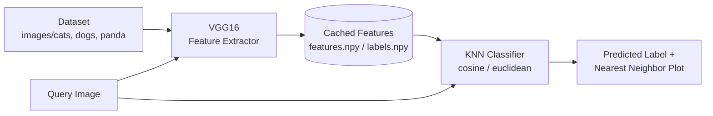

# Image Classification with VGG16 and KNN

A content-based image classifier that identifies cats, dogs, and pandas by combining deep features from a pretrained VGG16 network with a k-nearest-neighbors classifier.

## Overview

This project implements a transfer-learning approach to image classification. Instead of training a convolutional network from scratch, it uses **VGG16** (pretrained on ImageNet, classification head removed) purely as a feature extractor, converting each image into a 512-dimensional feature vector via global average pooling.

Classification itself is handled by a **K-Nearest Neighbors** classifier from scikit-learn: to classify a new image, the pipeline extracts its VGG16 feature vector, finds the `k` most similar images in the dataset (by cosine or euclidean distance), and predicts the majority label among those neighbors. The predicted label and the matched neighbor images are then plotted side by side for visual inspection.

Extracted features are cached to disk (`.npy` files) so the (relatively expensive) VGG16 forward pass over the full dataset only needs to run once.

## Key Features

- Transfer learning with VGG16 for feature extraction (no training required).
- KNN-based classification supporting both **cosine** and **euclidean** distance metrics.
- Feature caching to disk to avoid recomputation on subsequent runs.
- Visual output: displays the query image alongside its nearest neighbors and their labels.
- Simple CLI: classify one or more images, choose `k` and the distance metric.

## Technologies

**Machine Learning / Computer Vision**
- TensorFlow / Keras — VGG16 (ImageNet weights) as a feature extractor
- scikit-learn — `KNeighborsClassifier`

**Data & Imaging**
- NumPy — feature vector storage/caching
- Pillow — image loading
- Matplotlib — visualization of predictions and nearest neighbors

**Language**
- Python 3.13

## Architecture



On the first run, every dataset image is passed through VGG16 and the resulting features are cached. On later runs (and for every query image), only the query image needs to go through VGG16 — classification against the cached feature bank is fast.

## Project Structure

```
.
├── main.py                # Dataset loading, feature extraction, KNN classification, CLI
├── tests/
│   └── test_dataset.py    # Tests for dataset loading (no model/TensorFlow execution required)
├── images/
│   ├── cats/               # 1,000 images
│   ├── dogs/               # 1,000 images
│   └── panda/               # 1,000 images
├── testcat.jpg             # Sample query image
├── testdog.jpg              # Sample query image
├── features.npy             # Cached VGG16 features (auto-generated if missing)
├── labels.npy                # Cached labels (auto-generated if missing)
├── image_paths.npy            # Cached image paths (auto-generated if missing)
├── requirements.txt
└── LICENSE
```

## Installation

```bash
git clone https://github.com/bilalzoubaa/FDS.git
cd FDS
python -m venv venv

# Activate the virtual environment
# Windows:
venv\Scripts\activate
# macOS/Linux:
source venv/bin/activate

pip install -r requirements.txt
```

## Environment Variables

None. This project does not use environment variables, external services, or credentials.

## Usage

Classify the default sample images (`testdog.jpg`, `testcat.jpg`) with both cosine and euclidean distance:

```bash
python main.py
```

Classify a specific image with a chosen `k` and metric:

```bash
python main.py path/to/image.jpg -k 7 --metric cosine
```

Classify multiple images without opening plot windows (useful in headless/CI environments):

```bash
python main.py img1.jpg img2.jpg --no-show
```

CLI options:

| Flag | Description | Default |
|---|---|---|
| `images` (positional) | One or more image paths to classify | `testdog.jpg testcat.jpg` |
| `-k` | Number of nearest neighbors | `5` |
| `--metric` | `cosine` or `euclidean` | both are run if omitted |
| `--no-show` | Skip plotting the results | off |

On the first run, `main.py` extracts VGG16 features for the entire dataset and caches them to `features.npy`, `labels.npy`, and `image_paths.npy`. Subsequent runs load these directly, skipping re-extraction.

## API

This project is a standalone script/pipeline — it does not expose a web API or REST endpoints.

## Testing

A small test suite covers dataset loading (`tests/test_dataset.py`) and does not require TensorFlow model execution or the cached feature files, so it runs quickly:

```bash
pip install pytest
pytest tests/
```

There is currently no automated test for the feature extraction or KNN prediction steps, since they depend on the VGG16 weights and the full image dataset.

## Deployment

There is no deployed version of this project. It is intended to be run locally as a Python script.

## Future Improvements

- Expose the classifier through a small REST API (e.g. FastAPI) for programmatic predictions.
- Add a held-out validation split and report accuracy / confusion matrix instead of only visual inspection.
- Compare VGG16 features against other backbones (ResNet, EfficientNet, MobileNet).
- Add a Dockerfile for reproducible environments.
- Add CI (GitHub Actions) to run the test suite on every push.

## Author

**Bilal Zoubaa**

GitHub: [github.com/bilalzoubaa](https://github.com/bilalzoubaa)
LinkedIn: _add your profile link here_
